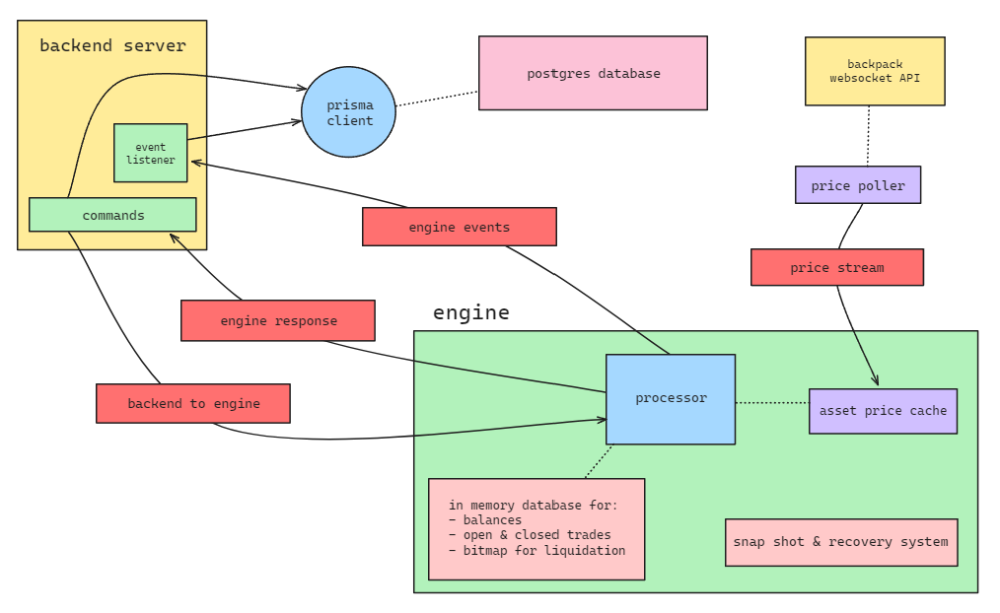

# Exness

A real-time trading exchange for CFD trading, built as a TypeScript monorepo. Users open leveraged long or short positions on BTC, ETH, and SOL, and the engine handles margin, liquidation, stop-loss, and take-profit automatically as prices stream in.



## Components

- `apps/backend` — Express API: auth (JWT), accounts, trade commands, order history. Talks to the engine over Redis Streams and persists orders and trades to PostgreSQL via Prisma.
- `apps/engine` — the trading engine. No HTTP server: it consumes commands and price updates from Redis Streams, keeps balances and open trades in memory, and publishes responses and trade events back onto streams.
- `apps/poller` — connects to Backpack Exchange's WebSocket bookTicker feed for BTC_USDC, ETH_USDC, and SOL_USDC and publishes price updates onto the engine's input stream.
- `apps/frontend` — Next.js dashboard: balances, trade open/close, order history, candlestick charts (Lightweight Charts, 24h candles from the Backpack API).

## Engine model

Commands flow through Redis Streams with consumer groups:

- `backend-to-engine` — commands from the API (CREATE_TRADE, CLOSE_TRADE, GET_BALANCE, CREATE_ACCOUNT, ...)
- `engine_input` — price updates from the poller
- `engine_response` — command responses back to the API
- `engine_events` — trade lifecycle events (TRADE_LIQUIDATED, TRADE_STOP_LOSS, TRADE_TAKE_PROFIT, TRADE_CLOSED)

State lives in memory as Maps: user balances, open and closed trades, and per-asset trigger bitmaps that make liquidation, stop-loss, and take-profit checks O(1) per price update instead of a scan over open trades.

Money is integer math throughout: balances and PnL are BigInts with fixed decimal scaling, never floats.

## Trading semantics

- Leverage from 1x to 100x. Margin is deducted on open and returned with PnL on close.
- Liquidation price: `entry - entry/leverage` for longs, `entry + entry/leverage` for shorts, computed at open and checked on every tick.
- Optional stop-loss and take-profit prices, checked the same way; trades close at the trigger price and emit the matching event.
- New accounts start with 5,000 USD of demo balance.

## Persistence and recovery

- PostgreSQL stores users, orders, and the full trade history (entry/exit prices, PnL, status).
- The engine snapshots its in-memory state every 5 seconds: gzip-compressed JSON with a SHA-256 checksum, keeping the last 10 snapshots. On startup it restores from the latest valid snapshot, falling back through previous ones if a checksum fails.

## Run

Everything at once:

```bash
docker-compose up
```

Postgres and Redis come up first, then backend (3005), frontend (3000), poller, and engine, gated by health checks.

For local dev: `pnpm install`, `pnpm build`, then `npm run dev` in each app (backend needs `DATABASE_URL`, `REDIS_URL`, `AUTH_JWT_SECRET`; engine and poller need `REDIS_URL`; frontend needs `NEXT_PUBLIC_API_URL`).

## API

Under `/api/v1`:

- `POST /user/signup`, `POST /user/signin`, `GET /user/me`, `GET /user/orders`, `GET /user/trades/:tradeId`
- `POST /engine` — single command endpoint for trade and account operations
- `GET /price?asset=SOL_USDC`, `GET /candles?asset=SOL&interval=1h`, `GET /supportedAssets`

## Stack

TypeScript, Express, Prisma + PostgreSQL, Redis Streams, Next.js + React, Zustand, Lightweight Charts, Zod, Turbo + pnpm workspaces, Docker Compose.
